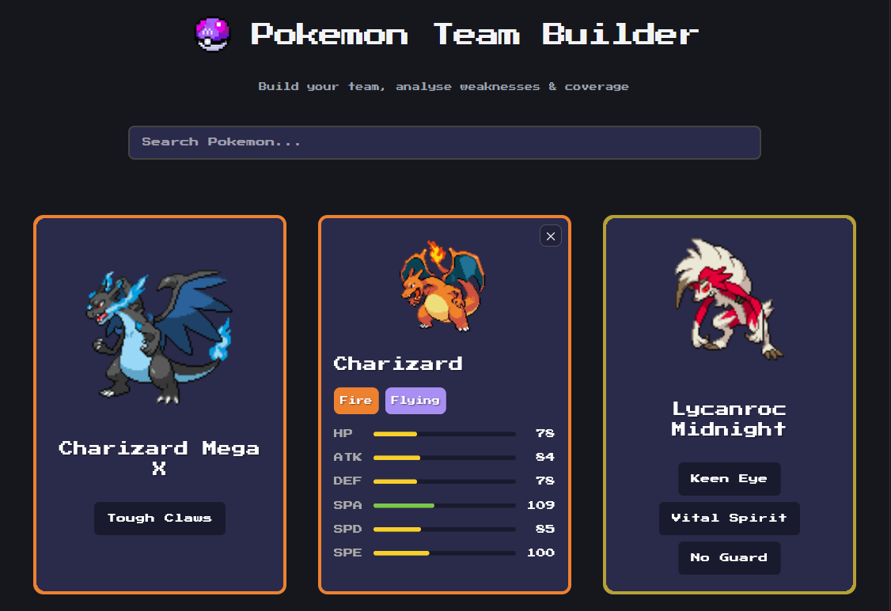
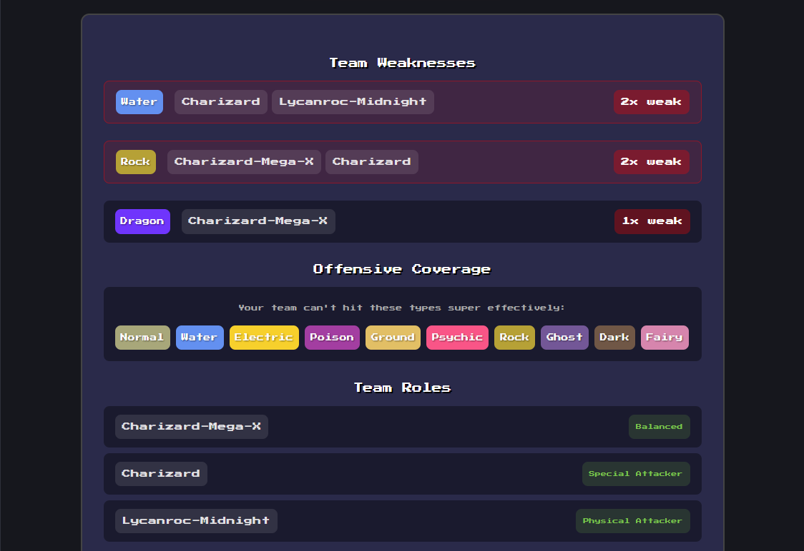
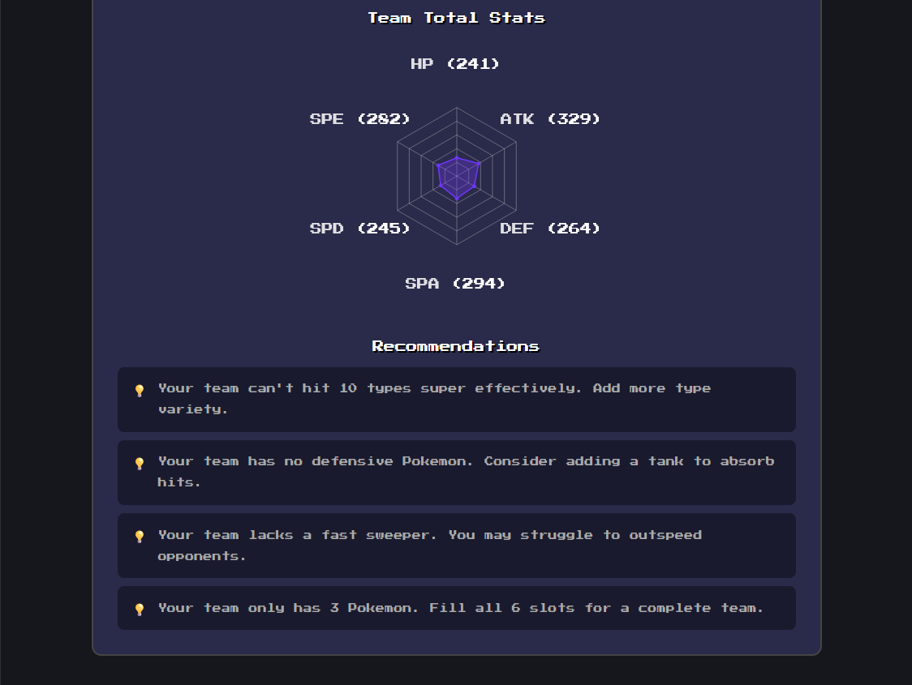

# Pokemon Team Builder

Build and analyse competitive Pokemon teams with an interactive, retro-styled interface.

**Live Demo:** [pokemon-team-builder-lbqr.onrender.com](https://pokemon-team-builder-lbqr.onrender.com)

## Features

- **Team Building** — Search and add up to 6 Pokemon to your team from the full PokeDex
- **Card Flip UI** — View stats on the front, abilities on the back (double tap on mobile)
- **Team Analysis** — Analyse your team's weaknesses, offensive coverage, and roles
- **Stat Radar Chart** — Visualise your team's combined stat distribution
- **Recommendations** — Get suggestions to improve your team composition
- **Responsive Design** — Works on desktop and mobile with adaptive layouts

## Tech Stack

- **Frontend:** React, TypeScript, Vite
- **Styling:** CSS with CSS variables, responsive design with media queries
- **Data:** [PokeAPI](https://pokeapi.co/)
- **Containerisation:** Docker, Nginx
- **CI/CD:** GitHub Actions, Render
- **Monitoring:** UptimeRobot

## Getting Started

### Prerequisites

- Node.js 20+
- npm
- Docker (optional, for containerised builds)

### Local Development

```bash
cd FrontEnd
npm install
npm run dev
```

The app will be available at `http://localhost:5173`.

### Docker

```bash
cd FrontEnd
docker compose up --build
```

The app will be available at `http://localhost:12345`.

## Project Structure

```
Pokemon Team Builder/
├── .github/
│   └── workflows/
│       └── ci.yml
├── FrontEnd/
│   ├── src/
│   │   ├── components/
│   │   │   ├── Analysis.tsx
│   │   │   ├── PokemonCard.tsx
│   │   │   ├── SearchBar.tsx
│   │   │   ├── StatRadarChart.tsx
│   │   │   ├── TeamDisplay.tsx
│   │   │   └── TitleBar.tsx
│   │   ├── utils/
│   │   │   ├── typeAnalysis.ts
│   │   │   ├── roleAnalysis.ts
│   │   │   └── recommendations.ts
│   │   ├── types/
│   │   ├── App.tsx
│   │   └── main.tsx
│   ├── public/
│   ├── Dockerfile
│   ├── docker-compose.yml
│   ├── nginx.conf
│   └── package.json
└── README.md
```

## Deployment

The app is deployed on [Render](https://render.com) with auto-deploy on push to `main`. The Docker image is built using a multi-stage build — Node.js for the build step, Nginx for serving the static files.

## Screenshots

### Desktop




### Mobile


## RoadMap

- Backend with user authentication to save teams
- Share teams via URL
- Suggest Pokemon to fill team weakness with the use of LLMs
- Add support for Smogon's Tier System for competitive team building

